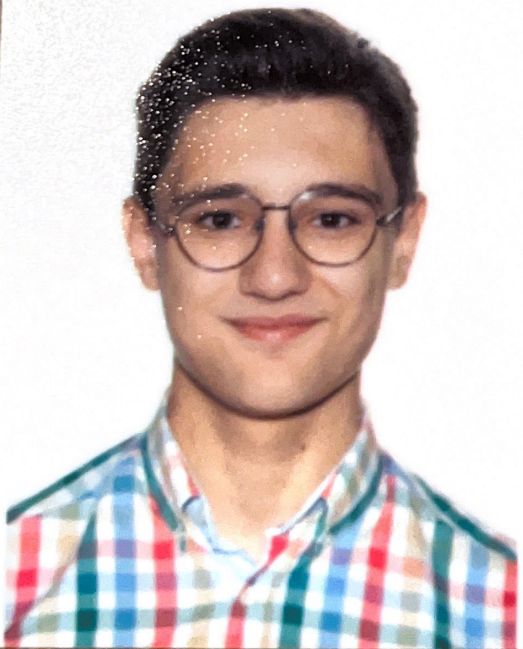

Hola 2ºDAM, soy Javier (me pillo la vaca loca)  

Aqui estan mis redes sociales:

Soy estudiante de 2ºDAM y llevo programando desde 2023
  - Programo en Java, HTML, CSS y JavaScrip
  - Nivel de ingles es un B2

Mis propositos es terminar los estudios, formarme en algun master de programación y trabajar en una empresa grande
Como son Microsoft, Google...

